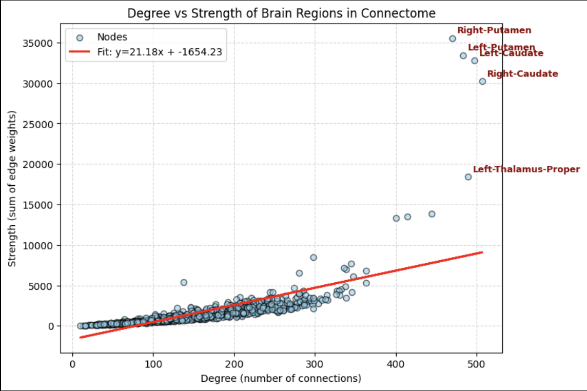
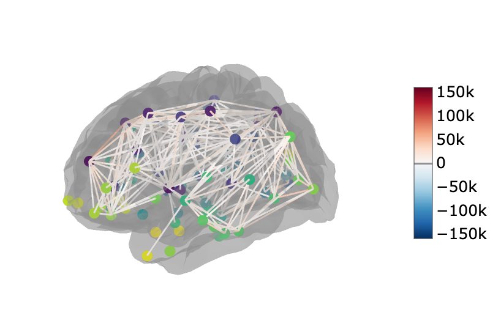

# Consensus Connectome Analysis

This repository provides a Python-based workflow for analyzing and visualizing a publicly available consensus brain connectome dataset from the PIT Bioinformatics group ([site](https://pitgroup.org/connectome/) and [GitHub repo](https://github.com/bricaud/brainviz2)). While the original visualizations from the PIT group use 3d.js, this project leverages Python tools to enable interactive connectome visualizations and including graph-theoretic metrics.

The workflow demonstrates how to:

1. Analyze the brain connection graph using networkx and bctpy

2. Create an interactive visualization of the connectome with nilearn in 3D

3. Provide summary statistics, graph measures, and insights on network organization

Please see `graph_analysis.ipynb` and `visualization.ipynb` for more information.

## Features

• Weighted, undirected connectome graph creation

• Calculation of basic network metrics like degree and strengh

  

• Computation of centrality measures: degree, betweenness, closeness, and eigenvector centrality

• Community detection and network organization analyses

• Global efficiency, assortativity, and small-worldness calculations

• 3D interactive visualizations with `nilearn.plotting.view_connectome`

  

• Fully Python-based workflow (no external JavaScript dependencies or browser-based viewing)

## Setup

```shell
# Create a virtual environment in the current directory
python -m venv venv

# Activate the virtual environment
# On macOS/Linux:
source venv/bin/activate
# On Windows (PowerShell):
# .\venv\Scripts\Activate.ps1
# On Windows (cmd):
# .\venv\Scripts\activate.bat

# Install dependencies
pip install -r requirements.txt
```

Then open the Jupyter notebook files in vscode and select the Python executable from your virtual environment.

## Data Sources

`budapest_connectome_3.0_5_0_median.csv` - full consensus connectome data from https://github.com/bricaud/brainviz2/blob/02afc69278629d1c02d3a7b6b40964baa71d3d89/budapest_connectome_3.0_5_0_median.csv

`DKT_space-MNI152NLin6_res-1x1x1.json` - The Desikan-Killiany-like visualization in the PIT repo suggests this atlas (or a similar DKT variant) corresponds to the parent regions used in the dataset. From https://github.com/neurodata/neuroparc/blob/master/atlases/label/Human/Metadata-json/DKT_space-MNI152NLin6_res-1x1x1.json
